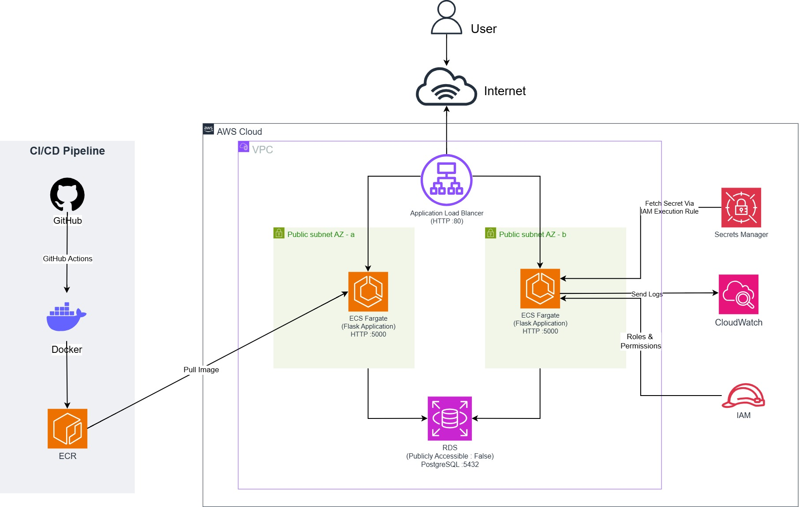

# Production-Style AWS Cloud Infrastructure with Terraform & CI/CD

[](https://github.com/sujithaakathirvel/production-cloud-application-aws/actions)
[](https://www.terraform.io/)
[](https://aws.amazon.com/fargate/)
[](https://aws.amazon.com/rds/)

---

## Architecture & Topology



The application runs inside an AWS VPC across two Availability Zones.

---

### Core Architectural Decisions & Trade-Offs

* **Compute Isolation:** Fargate removes OS-level management overhead; Security Groups restrict container ingress to the ALB only, on port `5000`.

* **Network Segmentation & Least-Privilege Ingress:** RDS PostgreSQL is non-public (`publicly_accessible = false`) and accepts traffic only from the ECS task security group, on port `5432`.

* **Cost-Aware Architecture Design:** ECS tasks run in public subnets with public IPs to avoid NAT Gateway costs, while Security Groups strip all public internet ingress at Layer 4/7 - providing layered network isolation without the additional NAT Gateway cost.

---

## Solution Highlights & Business Impact

| Engineering Focus | Business Challenge Addressed | Technical Implementation |
| :--- | :--- | :--- |
| **Infrastructure as Code** | Eliminates manual console setup, human error, and environment drift. | Modular **Terraform** configuration provisioning - VPC, ECS, RDS, IAM — as reproducible code. |
| **Automated CI/CD Pipeline** | Slow release cycles and manual deployment risks. | **GitHub Actions** pipeline building Docker images, pushing to **Amazon ECR**, and deploying to ECS in **43 seconds**. |
| **Credential Hardening** | Prevents source code credential leaks and hardcoded secrets. | Runtime DB credentials injected dynamically via **AWS Secrets Manager** and **IAM Task Execution Roles**, eliminating static passwords in code or environment files. |
| **High Availability & Healing** | Mitigates application crash and server failure risks. | ECS Service auto-recovery tested via task termination — replacement task reached Running, registered with the ALB, and passed health checks automatically. |

---
## Technology Stack

* **Cloud Provider:** AWS (VPC, ALB, ECS Fargate, ECR, RDS PostgreSQL, Secrets Manager, CloudWatch, IAM)
* **Infrastructure as Code:** Terraform
* **Application & Runtime:** Python 3.x, Flask, PostgreSQL
* **Containerisation & CI/CD:** Docker, GitHub Actions
* **Observability & Testing:** AWS CloudWatch Logs, Apache JMeter

---

## Performance & Resilience Validation

### 1. Automated Baseline Load Validation (Apache JMeter)
To validate infrastructure stability under concurrent requests through the public Load Balancer:

* **Configuration:** 10 concurrent threads x 10 iterations (100 total requests to `/health`).
* **Error Rate:** **0.00%**
* **Average Response Latency:** **11.94 ms** (Median: 10 ms | P95: 24 ms)
* **Throughput:** 22.02 req/sec baseline

### 2. Failure Recovery & Horizontal Scaling Tests
* **Task Self-Healing:** Intentionally killed a running ECS task. The ECS service scheduler detected the task count fell below the desired count and launched a replacement automatically; once healthy, the ALB registered the new task and deregistered the failed one from rotation.
* **Elastic Capacity Adjustments:** Scaled task count from `1 ➔ 2 ➔ 1`. Confirmed ALB registered both instances into rotation with active multi-target health checks.

---

## Deployment & Setup Guide

### Prerequisites

* [AWS CLI v2](https://aws.amazon.com/cli/) configured with deployment credentials.
* [Terraform >= 1.0](https://www.terraform.io/)
* [Docker Desktop](https://www.docker.com/)

### 1. Provision Infrastructure

```bash
git clone https://github.com/sujithaakathirvel/production-cloud-application-aws.git
cd production-cloud-application-aws/infra
terraform init
terraform plan
terraform apply
```
## 2. CI/CD Pipeline Execution

Automated deployments trigger on every push to `main`. The pipeline performs:

1. Repository checkout and AWS authentication using GitHub Actions secrets (AWS access key/secret).
2. Building and tagging the container image with the Git commit SHA (`${GITHUB_SHA::7}`).
3. Publishing the image to Amazon ECR.
4. Retrieving the current ECS task definition and updating it with the new image.
5. Registering a new task definition revision and updating the ECS service to trigger a rolling deployment.

---

**Repository Structure**

```
.
├── .github/workflows/   # Automated CI/CD deployment pipeline
├── app/                 # Containerised Flask application source code
│   ├── models/          # Database ORM models
│   ├── routes/          # API endpoints & controller logic
│   ├── Dockerfile       # Containerised application build
│   └── main.py          # Application entrypoint
├── infra/               # Declarative Infrastructure as Code
│   ├── modules/         # Reusable modules (VPC, ECS, RDS, ALB, ECR, Security)
│   ├── main.tf          # Core infrastructure orchestrator
│   └── outputs.tf       # ALB DNS name & resource outputs
└── performance/         # Apache JMeter test plans (.jmx)
```


